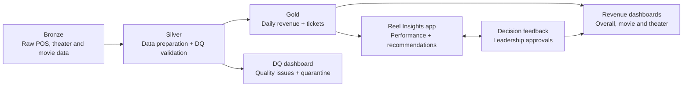

# Theater analytics data flow

[View the diagram](theater_enhancements_dataflow.svg)

```mermaid
flowchart LR
    Bronze["Bronze<br/>Raw POS, theater and movie data"]
    Silver["Silver<br/>Data preparation + DQ validation"]
    Gold["Gold<br/>Daily revenue + tickets"]
    DQ["DQ dashboard<br/>Quality issues + quarantine"]
    Revenue["Revenue dashboards<br/>Overall, movie and theater"]
    App["Reel Insights app<br/>Performance + recommendations"]
    Feedback["Decision feedback<br/>Leadership approvals"]

    Bronze --> Silver --> Gold --> App
    Silver --> DQ
    Gold --> Revenue
    App <--> Feedback
    Feedback --> Revenue
```
